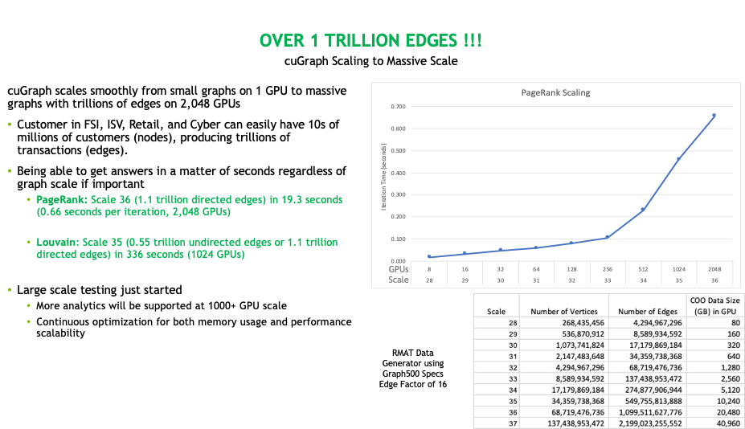

# <div align="left">&nbsp;cuGraph - GPU Graph Analytics</div>

[](https://gpuci.gpuopenanalytics.com/job/rapidsai/job/gpuci/job/cugraph/job/branches/job/cugraph-branch-pipeline/)

The [RAPIDS](https://rapids.ai) cuGraph library is a collection of GPU accelerated graph algorithms that process data found in [GPU DataFrames](https://github.com/rapidsai/cudf).  The vision of cuGraph is _to make graph analysis ubiquitous to the point that users just think in terms of analysis and not technologies or frameworks_.  To realize that vision, cuGraph operates, at the Python layer, on GPU DataFrames, thereby allowing for seamless passing of data between ETL tasks in [cuDF](https://github.com/rapidsai/cudf) and machine learning tasks in [cuML](https://github.com/rapidsai/cuml).  Data scientists familiar with Python will quickly pick up how cuGraph integrates with the Pandas-like API of cuDF.  Likewise, users familiar with NetworkX will quickly recognize the NetworkX-like API provided in cuGraph, with the goal to allow existing code to be ported with minimal effort into RAPIDS.  For users familiar with C++/CUDA and graph structures, a C++ API is also provided.  However, there is less type and structure checking at the C++ layer.

 For more project details, see [rapids.ai](https://rapids.ai/).

**NOTE:** For the latest stable [README.md](https://github.com/rapidsai/cugraph/blob/main/README.md) ensure you are on the latest branch.

As an example, the following Python snippet loads graph data and computes PageRank:

```python
import cudf
import cugraph

# read data into a cuDF DataFrame using read_csv
gdf = cudf.read_csv("graph_data.csv", names=["src", "dst"], dtype=["int32", "int32"])

# We now have data as edge pairs
# create a Graph using the source (src) and destination (dst) vertex pairs
G = cugraph.Graph()
G.from_cudf_edgelist(gdf, source='src', destination='dst')

# Let's now get the PageRank score of each vertex by calling cugraph.pagerank
df_page = cugraph.pagerank(G)

# Let's look at the PageRank Score (only do this on small graphs)
for i in range(len(df_page)):
	print("vertex " + str(df_page['vertex'].iloc[i]) +
		" PageRank is " + str(df_page['pagerank'].iloc[i]))
```

## Getting cuGraph
There are 3 ways to get cuGraph :
1. [Quick start with Docker Repo](#quick)
2. [Conda Installation](#conda)
3. [Build from Source](#source)
<br/><br/>

---
# cuGraph News

### Scaling to 1 Trillion Edges
cuGraph was recently tested on the Selene supercomputer using 2,048 GPUs and processing a graph with `1.1 Trillion edges`. 

<div align="left">&nbsp;</br>cuGraph Scaling</div>
</br></br>

### cuGraph Software Stack
cuGraph has a new multi-layer software stack that allows users and system integrators to access cuGraph at different layers.  

<div align="left">&nbsp;</br>cuGraph Software Stack</div>
</br></br>


# Currently Supported Features
As of Release 21.08 - including 21.08 nightly


## Supported Algorithms
_Italic_ algorithms are planned for future releases.

| Category     | Algorithm                              | Scale        |  Notes              |
| ------------ | -------------------------------------- | ------------ | ------------------- |
| Centrality   |                                        |              |                     |
|              | Katz                                   | Multi-GPU    |                     |
|              | Betweenness Centrality                 | Single-GPU   | MG planned for 22.08                    |
|              | Edge Betweenness Centrality            | Single-GPU   |                     |
|              | _Eigenvector Centrality_               |              | _MG planned for 22.06_ |
| Community    |                                        |              |                     |
|              | Leiden                                 | Single-GPU   |                     |
|              | Louvain                                | Multi-GPU    |  [C++ README](cpp/src/community/README.md#Louvain) |
|              | Ensemble Clustering for Graphs         | Single-GPU   |                     |
|              | Spectral-Clustering - Balanced Cut     | Single-GPU   |                     |
|              | Spectral-Clustering - Modularity       | Single-GPU   |                     |
|              | Subgraph Extraction                    | Single-GPU   |                     |
|              | Triangle Counting                      | Single-GPU   | MG planned for 22.06                    |
|              | K-Truss                                | Single-GPU   | MG planned for 22.10                    |
| Components   |                                        |              |                     |
|              | Weakly Connected Components            | Multi-GPU    |                     |
|              | Strongly Connected Components          | Single-GPU   | MG planned for 22.06      |
| Core         |                                        |              |                     |
|              | K-Core                                 | Single-GPU   | MG planned for 22.10                    |
|              | Core Number                            | Single-GPU   | MG planned for 22.08                    |
| _Flow_       |                                        |              |                     |
|              | _MaxFlow_                              | ---          |                     |
| _Influence_  |                                        |              |                     |
|              | _Influence Maximization_               | ---          |                     |
| Layout       |                                        |              |                     |
|              | Force Atlas 2                          | Single-GPU   |                     |
| Linear Assignment|                                    |              |                     |
|              | Hungarian                              | Single-GPU   | [README](cpp/src/linear_assignment/README-hungarian.md) |
| Link Analysis|                                        |              |                     |
|              | Pagerank                               | Multi-GPU    | [C++ README](cpp/src/centrality/README.md#Pagerank) |
|              | Personal Pagerank                      | Multi-GPU    | [C++ README](cpp/src/centrality/README.md#Personalized-Pagerank) |
|              | HITS                                   | Multi-GPU    |                     |
| Link Prediction |                                     |              |                     |
|              | Jaccard Similarity                     | Single-GPU   |                     |
|              | Weighted Jaccard Similarity            | Single-GPU   |                     |
|              | Overlap Similarity                     | Single-GPU   |                     |
|              | Sorensen Coefficient                   | Single-GPU   |                     |
|              | _Local Clustering Coefficient_         |   ---        |                     |
| Sampling     |                                        |              |                     |
|              | Random Walks (RW)                      | Single-GPU   | Biased and Uniform  |
|              | Egonet                                 | Single-GPU   | multi-seed          |
|              | Node2Vec                               | Single-GPU   |                     |
|              | Neighborhood sampling                  | Multi-GPU    |                     |
| Traversal    |                                        |              |                     |
|              | Breadth First Search (BFS)             | Multi-GPU    | with cutoff support <br/> [C++ README](cpp/src/traversal/README.md#BFS) |
|              | Single Source Shortest Path (SSSP)     | Multi-GPU    | [C++ README](cpp/src/traversal/README.md#SSSP) |
|              | _ASSP / APSP_                          |              |                     |
| Tree         |                                        |              |                     |
|              | Minimum Spanning Tree                  | Single-GPU   |                     |
|              | Maximum Spanning Tree                  | Single-GPU   |                     |
| Other        |                                        |              |                     |
|              | Renumbering                            | Multi-GPU    | multiple columns, any data type  |
|              | Symmetrize                             | Multi-GPU    |                     |
|              | Path Extraction                        |              | Extract paths from BFS/SSP results in parallel | 
| Data Generator  |                                     |              |                     |
|              | RMAT                                   | Multi-GPU    |                     |
|              | _Barabasi-Albert_                      |  ---         |                     |
|  |  |

</br></br>
## Supported Graph
| Type            |  Description                                        |
| --------------- | --------------------------------------------------- |
| Graph           | An undirected Graph is default                      |
|                 | directed=True yields a Directed Graph               |
| Multigraph      | A Graph with multiple edges between a vertex pair   |
|  |  |

ALL Algorithms support Graphs and MultiGraph (directed and undirected)


</br></br>
## Supported Data Types
cuGraph supports graph creation with Source and Destination being expressed as:
* cuDF DataFrame
* Pandas DataFrame

cuGraph supports execution of graph algorithms from different graph objects
* cuGraph Graph classes
* NetworkX graph classes
* CuPy sparse matrix
* SciPy sparse matrix

cuGraph tries to match the return type based on the input type.  So a NetworkX input will return the same data type that NetworkX would have.


## cuGraph Notice

Vertex IDs are expected to be contiguous integers starting from 0.  If your data doesn't match that restriction, we have a solution.  cuGraph provides the renumber function, which is by default automatically called when data is addted to a graph.  Input vertex IDs for the renumber function can be any type, can be non-contiguous, can be multiple columns, and can start from an arbitrary number. The renumber function maps the provided input vertex IDs to either 32- or 64-bit contiguous integers starting from 0. 

Additionally, when using the auto-renumbering feature, vertices are automatically un-renumbered in results.

cuGraph is constantly being updated and improved. Please see the [Transition Guide](TRANSITIONGUIDE.md) if errors are encountered with newer versions

## Graph Sizes and GPU Memory Size
The amount of memory required is dependent on the graph structure and the analytics being executed.  As a simple rule of thumb, the amount of GPU memory should be about twice the size of the data size.  That gives overhead for the CSV reader and other transform functions.  There are ways around the rule but using smaller data chunks.

|       Size        | Recommended GPU Memory |
|-------------------|------------------------|
| 500 million edges |  32 GB                 |
| 250 million edges |  16 GB                 |

The use of managed memory for oversubscription can also be used to exceed the above memory limitations.  See the recent blog on _Tackling Large Graphs with RAPIDS cuGraph and CUDA Unified Memory on GPUs_:  https://medium.com/rapids-ai/tackling-large-graphs-with-rapids-cugraph-and-unified-virtual-memory-b5b69a065d4

</br></br>

---
## Quick Start <a name="quick"></a>
Please see the [Docker Repository](https://hub.docker.com/r/rapidsai/rapidsai/), choosing a tag based on the NVIDIA CUDA version you’re running. This provides a ready to run Docker container with example notebooks and data, showcasing how you can utilize all of the RAPIDS libraries: cuDF, cuML, and cuGraph.


## Conda <a name="conda"></a>
It is easy to install cuGraph using conda. You can get a minimal conda installation with [Miniconda](https://conda.io/miniconda.html) or get the full installation with [Anaconda](https://www.anaconda.com/download).

Install and update cuGraph using the conda command:

```bash


# CUDA 11.4
conda install -c nvidia -c rapidsai -c numba -c conda-forge cugraph cudatoolkit=11.4

# CUDA 11.5
conda install -c nvidia -c rapidsai -c numba -c conda-forge cugraph cudatoolkit=11.5

For CUDA > 11.5, please use the 11.5 environment
```

Note: This conda installation only applies to Linux and Python versions 3.8/3.9.


## Build from Source and Contributing <a name="source"></a>

Please see our [guide for building cuGraph from source](SOURCEBUILD.md)</pr>

Please see our [guide for contributing to cuGraph](CONTRIBUTING.md).


## Documentation
Python API documentation can be generated from [docs](docs) directory.


------

## <div align="left"></div> Open GPU Data Science

The RAPIDS suite of open source software libraries aims to enable execution of end-to-end data science and analytics pipelines entirely on GPUs. It relies on NVIDIA® CUDA® primitives for low-level compute optimization but exposing that GPU parallelism and high-bandwidth memory speed through user-friendly Python interfaces.

<p align="center"></p>

### Apache Arrow on GPU

The GPU version of [Apache Arrow](https://arrow.apache.org/) is a common API that enables efficient interchange of tabular data between processes running on the GPU. End-to-end computation on the GPU avoids unnecessary copying and converting of data off the GPU, reducing compute time and cost for high-performance analytics common in artificial intelligence workloads. As the name implies, cuDF uses the Apache Arrow columnar data format on the GPU. Currently, a subset of the features in Apache Arrow are supported.
