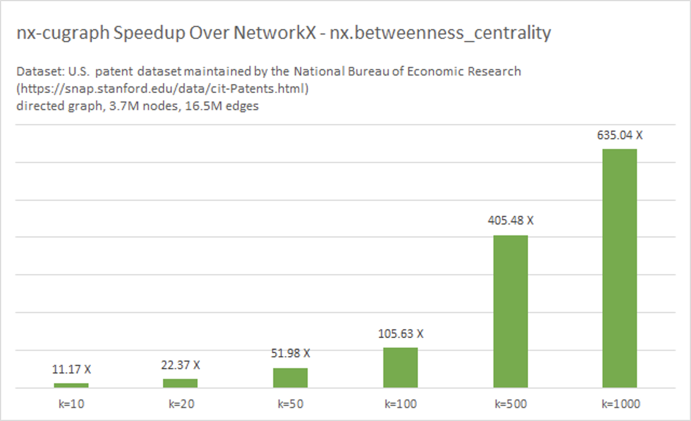

# Benchmarks

## NetworkX vs. nx-cugraph
We ran several commonly used graph algorithms on both `networkx` and `nx-cugraph`. Here are the results

<figure>

<figcaption style="text-align: center;">Results from running this <a
href="https://github.com/rapidsai/cugraph/blob/HEAD/benchmarks/nx-cugraph/pytest-based/bench_algos.py">Benchmark</a></figcaption>
</figure>

## Reproducing Benchmarks

Below are the steps to reproduce the results on your workstation. These are documented in this [README](https://github.com/rapidsai/cugraph/blob/HEAD/benchmarks/nx-cugraph/pytest-based).

1. Clone the latest <https://github.com/rapidsai/cugraph>

2. Follow the instructions to build an environment

3. Activate the environment

4. Install the latest `nx-cugraph` by following the [guide](installation.md)

5. Follow the instructions written in the README here: `cugraph/benchmarks/nx-cugraph/pytest-based/`
