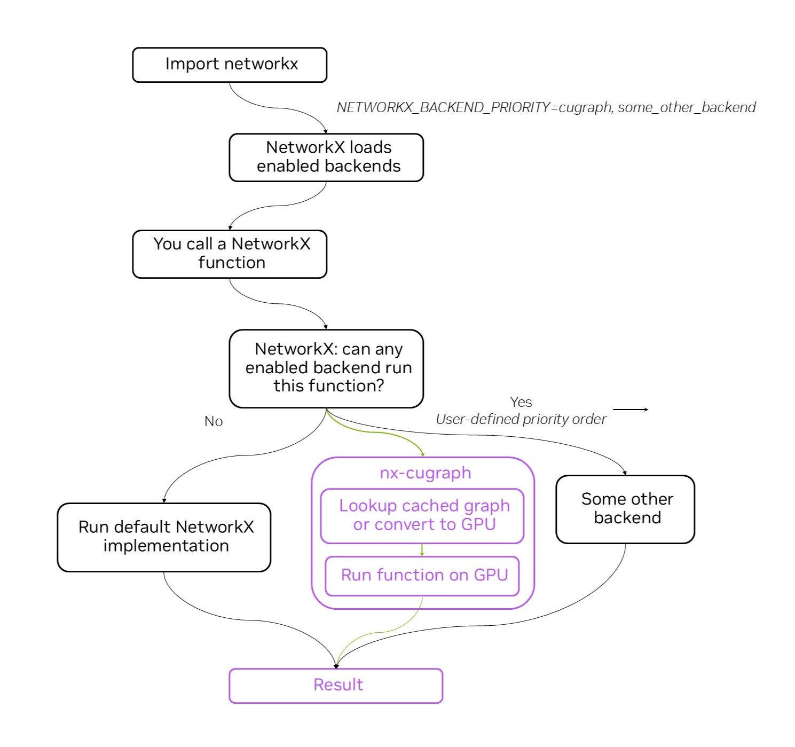

# How it Works

NetworkX has the ability to **dispatch function calls to separately-installed third-party backends**.

NetworkX backends let users experience improved performance and/or additional functionality without changing their NetworkX Python code. Examples include backends that provide algorithm acceleration using GPUs, parallel processing, graph database integration, and more.

While NetworkX is a pure-Python implementation with minimal to no dependencies, backends may be written in other languages and require specialized hardware and/or OS support, additional software dependencies, or even separate services. Installation instructions vary based on the backend, and additional information can be found from the individual backend project pages listed in the NetworkX Backend Gallery.




## Enabling nx-cugraph

NetworkX will use nx-cugraph as the graph analytics backend if any of the
following are used:

### `NETWORKX_BACKEND_PRIORITY` environment variable.

The `NETWORKX_BACKEND_PRIORITY` environment variable can be used to have NetworkX automatically dispatch to specified backends. This variable can be set to a single backend name, or a comma-separated list of backends ordered using the priority which NetworkX should try.  If a NetworkX function is called that nx-cugraph supports, NetworkX will redirect the function call to nx-cugraph automatically, or fall back to the next backend in the list if provided, or run using the default NetworkX implementation. See [NetworkX Backends and Configs](https://networkx.org/documentation/stable/reference/backends.html).

For example, this setting will have NetworkX use nx-cugraph for any function called by the script supported by nx-cugraph, and the default NetworkX implementation for all others.
```
bash> NETWORKX_BACKEND_PRIORITY=cugraph python my_networkx_script.py
```

This example will have NetworkX use nx-cugraph for functions it supports, then try other_backend if nx-cugraph does not support them, and finally the default NetworkX implementation if not supported by either backend:
```
bash> NETWORKX_BACKEND_PRIORITY="cugraph,other_backend" python my_networkx_script.py
```

### `backend=` keyword argument

To explicitly specify a particular backend for an API, use the `backend=`
keyword argument. This argument takes precedence over the
`NETWORKX_BACKEND_PRIORITY` environment variable. This requires anyone
running code that uses the `backend=` keyword argument to have the specified
backend installed.

Example:
```python
nx.betweenness_centrality(cit_patents_graph, k=k, backend="cugraph")
```

### Type-based dispatching

NetworkX also supports automatically dispatching to backends associated with
specific graph types. Like the `backend=` keyword argument example above, this
requires the user to write code for a specific backend, and therefore requires
the backend to be installed, but has the advantage of ensuring a particular
behavior without the potential for runtime conversions.

To use type-based dispatching with nx-cugraph, the user must import the backend
directly in their code to access the utilities provided to create a Graph
instance specifically for the nx-cugraph backend.

Example:
```python
import networkx as nx
import nx_cugraph as nxcg

G = nx.Graph()
...
nxcg_G = nxcg.from_networkx(G)             # conversion happens once here
nx.betweenness_centrality(nxcg_G, k=1000)  # nxcg Graph type causes cugraph backend
                                           # to be used, no conversion necessary
```

## Command Line Example

---

Create `bc_demo.ipy` and paste the code below.

```python
import pandas as pd
import networkx as nx

url = "https://data.rapids.ai/cugraph/datasets/cit-Patents.csv"
df = pd.read_csv(url, sep=" ", names=["src", "dst"], dtype="int32")
G = nx.from_pandas_edgelist(df, source="src", target="dst")

%time result = nx.betweenness_centrality(G, k=10)
```
Run the command:
```
user@machine:/# ipython bc_demo.ipy
```

You will observe a run time of approximately 7 minutes...more or less depending on your CPU.

Run the command again, this time specifying cugraph as the NetworkX backend.
```
user@machine:/# NETWORKX_BACKEND_PRIORITY=cugraph ipython bc_demo.ipy
```
This run will be much faster, typically around 20 seconds depending on your GPU.
```
user@machine:/# NETWORKX_BACKEND_PRIORITY=cugraph ipython bc_demo.ipy
```
There is also an option to cache the graph conversion to GPU. This can dramatically improve performance when running multiple algorithms on the same graph. Caching is enabled by default for NetworkX versions 3.4 and later, but if using an older version, set "NETWORKX_CACHE_CONVERTED_GRAPHS=True"
```
NETWORKX_BACKEND_PRIORITY=cugraph NETWORKX_CACHE_CONVERTED_GRAPHS=True ipython bc_demo.ipy
```

When running Python interactively, the cugraph backend can be specified as an argument in the algorithm call.

For example:
```
nx.betweenness_centrality(cit_patents_graph, k=k, backend="cugraph")
```


The latest list of algorithms supported by nx-cugraph can be found [here](https://github.com/rapidsai/cugraph/blob/HEAD/python/nx-cugraph/README.md#algorithms) or in the next section.

---
