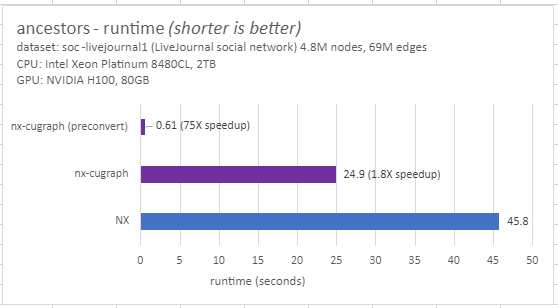
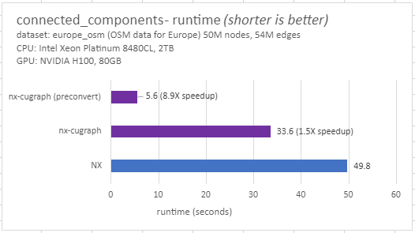
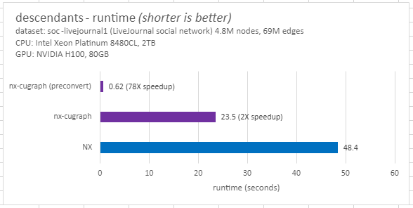
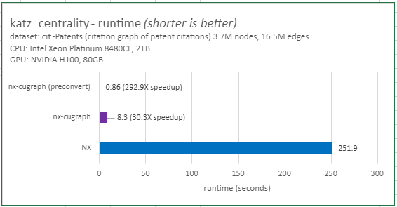
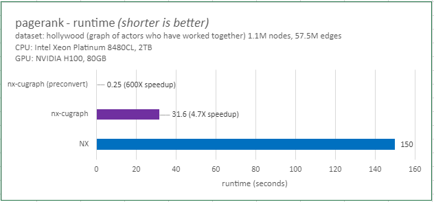
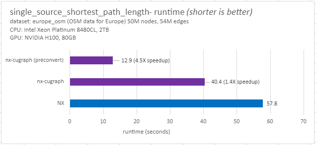

### nx_cugraph

`nx-cugraph` is a [networkX backend](<https://networkx.org/documentation/stable/reference/utils.html#backends>) that accelerates many popular NetworkX functions using cuGraph and NVIDIA GPUs.
Users simply [install and enable nx-cugraph](installation.md) to experience GPU speedups.

Lets look at some examples of algorithm speedups comparing CPU based NetworkX to dispatched versions run on GPU with nx_cugraph.

