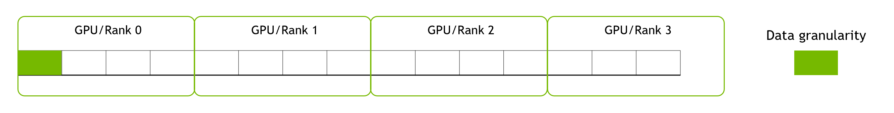
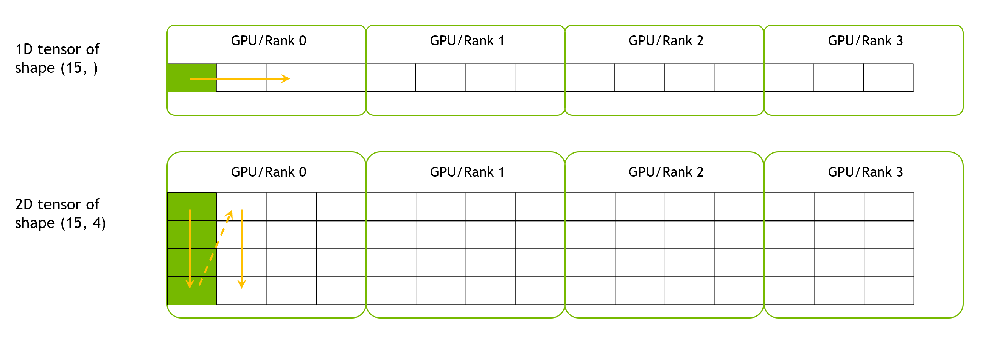
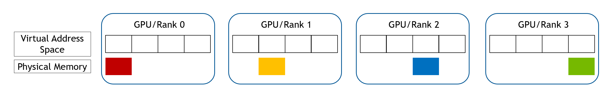
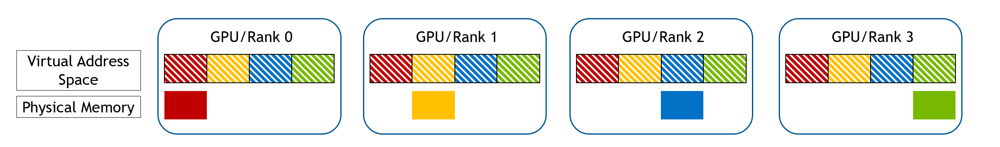
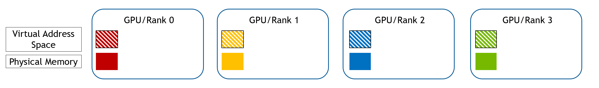
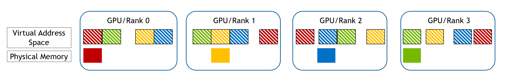
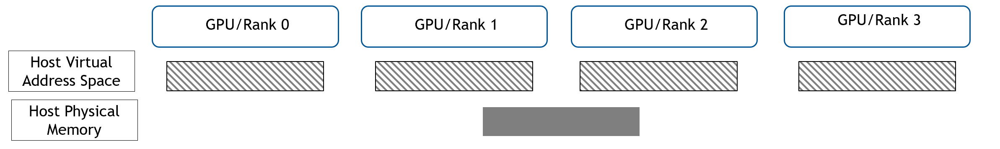
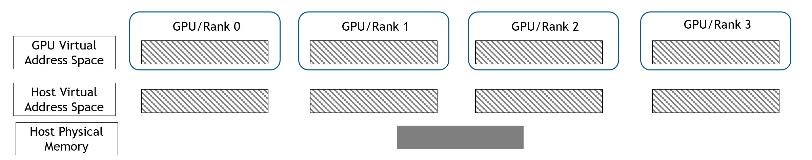
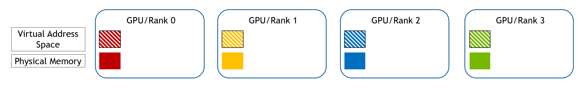

# WholeMemory Implementation Details
As described in [WholeMemory Introduction](wholegraph_intro.md), there are two WholeMemory location and three
WholeMemory types. So there will be total six WholeMemory.

|     Type      | CONTINUOUS  | CONTINUOUS |  CHUNKED  |  CHUNKED  | DISTRIBUTED | DISTRIBUTED |
|:-------------:|:-----------:|:----------:|:---------:|:---------:|:-----------:|:-----------:|
|   Location    |   DEVICE    |    HOST    |  DEVICE   |   HOST    |   DEVICE    |    HOST     |
| Allocated by  |    EACH     |   FIRST    |   EACH    |   FIRST   |    EACH     |    EACH     |
| Allocate API  |   Driver    |    Host    |  Runtime  |   Host    |   Runtime   |   Runtime   |
|  IPC Mapping  |   Unix fd   |    mmap    |  cudaIpc  |   mmap    | No IPC map  | No IPC map  |

For "Continuous" and "Chunked" type of WholeMemory, all memory are mapped to each GPU,
so these two types are all "Mapped" WholeMemory, in opposite is "Distributed" WholeMemory which are not all mapped.

## WholeMemory Layout
As the underlying memory of a single WholeMemory object may be on multiple GPU devices, so our WholeGraph library will
partition data into these GPU devices.
The partition method guarantees that each GPU can access one continuous part of the entire memory.
Here "can access" means can directly access from CUDA kernels, but the memory don't have to be physically on that GPU.
For example, they may on host memory or other GPU's device memory that can be access using P2P.
In case the stored data have its own granularity that don't want to be split, when creating WholeMemory,
data granularity can be specified. Then each data granularity can be considered as a block of data.

The follow figure shows the layout of 15 data block over 4 GPUs.

For WholeMemory Tensors, they can be 1D or 2D tensors.
For 1D tensor, data granularity is one element. For 2D tensor, data granularity is its 1D tensor.
Their layout will be like this:

## WholeMemory Allocation
As there are six types of WholeMemory, the allocation process of each type are as following:

### Device Continuous WholeMemory
For Device Continuous WholeMemory, first a range of virtual address space is reserved in each GPU, which covers the
entire memory range. Then a part of pyhsical memory is allocated in each GPU, like shown in the follow figure.

After that, each GPU gather all the handles of memory from all GPUs, and mapped them to the reserved address space.

### Device Chunked WholeMemory
For Deivce Chunked WholeMemory, first each GPU allocate its own part of memory using CUDA runtime API, this will create
both virtual address space and physical memory for its own memory.

They each GPU gather the Ipc handle of memory from all other GPUs, and mapped that into its own virtual address space.

### Host Mapped WholeMemory
For Host, Continuous and Chunked are using same method. First rank allocate the host physical and share that to all
ranks.

Then each rank register that host memory to GPU address space.

### Distributed WholeMemory
For Distributed WholeMemory, each GPU just malloc its own part of memory, no need to share to other GPUs.

