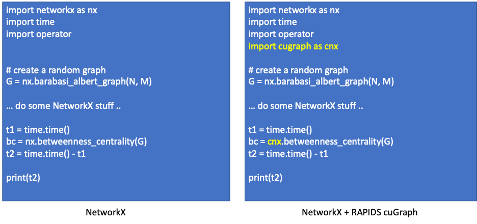

# NetworkX Compatibility and Transition

*Note: this is a work in progress and will be updatred and changed as we better flesh out 
compatibility issues*

One of the goals of RAPIDS cuGraph is to mimic the NetworkX API to simplify
the transition to accelerated GPU data science.  However, graph analysis,
also called network science, like most other data science workflow, is more
than just running an algorithm.  Graph data requires cleaning and prep (ETL)
and then the construction of a graph object; that is all before the execution
of a graph algorithm.  RAPIDS and cuGraph allow a portion or the complete
analytic workflow to be accelerated.  To achieve the maximum amount of
acceleration, we encourage fully replacing existing code with cuGraph.
But sometimes it is easier to replace just a portion. 

## Last Update
Last Update:	Oct 14th, 2020
Release:		0.16

Information on [NetworkX](https://networkx.github.io/documentation/stable/index.html)

This transition guide in an expansion of the Medium Blog on [NetworkX Compatibility](https://medium.com/rapids-ai/rapids-cugraph-networkx-compatibility-d119e417557c)


## Easy Path – Use NetworkX Graph Objects, Accelerated Algorithms

Rather than updating all of your existing code, simply update the calls to
graph algorithms by replacing the module name.  This allows all the complicated
ETL code to be unchanged while still seeing significate performance
improvements.  

In the following example, the cuGraph module is being imported as “cnx”.
While module can be assigned any name can be used, we picked cnx to reduce
the amount of text to be changed. The text highlighted in yellow indicates
changes.



It is that easy.  All algorithms in cuGraph support a NetworkX graph object as
input and match the NetworkX API list of arguments.  

Currently, cuGraph accepts both NetworkX Graph and DiGraph objects. We will be
adding support for Bipartite graph and Multigraph over the next few releases.  

 


## Differences in Algorithms
Since cuGraph currently does not support attribute rich graphs, those
algorithms that return simple scores (centrality, clustering, etc.) best match
the NetworkX process.  Algorithms that return a subgraph will do so without
any additional attributes on the nodes or edges. 

### Algorithms that exactly match
|       Algorithm           |     Differences        |
|---------------------------|------------------------|
| Core Number 	            | None |
| HITS 	| None 
| PageRank 	| None 
| Personal PageRank | None 
| Strongly Connected Components | None 
| Weakly Connected Components | None 
| | 
<br/><br/>


### Algorithms that exactly match but do not copy over additional attributes 
|       Algorithm           |     Differences        |
|---------------------------|------------------------|
| K-Truss | Does not copy over attributes 
| K-Core | Does not copy over attributes 
| Subgraph Extraction | Does not copy over attributes 
| |
<br/><br/>

#### Algorithms not in NetworkX
|       Algorithm           |     Differences        |
|---------------------------|------------------------|
| Ensemble Clustering for Graphs (ECG) | Currently not in NetworkX 
| Force Atlas 2 | Currently not in NetworkX 
| Leiden | Currently not in NetworkX 
| Louvain | Currently not in NetworkX 
| Overlap coefficient  | Currently not in NetworkX 
| Spectral Clustering  | Currently not in NetworkX 
| |
<br/><br/>


### Algorithm where not all arguments are supported
|       Algorithm           |     Differences        |
|---------------------------|------------------------|
|Betweenness Centrality     | weight is currently not supported – ignored    |
|                           | endpoints is currently not supported – ignored |
|Edge Betweenness Centrality | weight is currently not supported – ignored 
| Katz Centrality 	         | beta is currently not supported – ignored 
|                           | max_iter defaults to 100 versus 1000 
| |
<br/><br/>

### Algorithms where the results are different
For example, the NetworkX traversal algorithms typically return a generator rather than a dictionary.   
|       Algorithm           |     Differences        |
|---------------------------|------------------------|
| Triangle Counting  | this algorithm simply returns the total number of triangle and not the number per vertex (on roadmap to update) 
| Jaccard coefficient | Currently we only do a 1-hop computation rather than an all-pairs.  Fix is on roadmap 
| Breadth First Search (BFS) | Return a Pandas DataFrame with: [vertex][distance][predecessor] 
| Single Source Shortest Path (SSSP) | Return a Pandas DataFrame with: [vertex][distance][predecessor] 
| |
<br/><br/>

## Graph Building
The biggest difference between NetworkX and cuGraph is with how Graph objects are built.  NetworkX, for the most part, stores graph data in a dictionary.  That structure allows easy insertion of new records.    Consider the following code for building a NetworkX Graph:

```
    # Read the node data
    df = pd.read_csv( data_file)

    # Construct graph from edge list.
    G = nx.DiGraph()

    for row in df.iterrows():
        G.add_edge(
            row[1]["1"], row[1]["2"], count=row[1]["3"]
        )
```

The code block is perfectly fine for NetworkX. However, the process of iterating over the dataframe and adding one node at a time is problematic for GPUs and something that we try and avoid.  cuGraph stores data in columns (i.e. arrays).  Resizing an array requires allocating a new array one element larger, copying the data, and adding the new value.  That is not very efficient.  

If your code follows the above model of inserting one element at a time, the we suggest either rewriting that code or using it as is within NetworkX and just accelerating the algorithms with cuGraph.  

Now, if your code bulk loads the data from Pandas, then RAPIDS can accelerate that process by orders of magnitude.


The above cuGraph code will create cuGraph.Graph object and not a NetworkX.Graph object. 

