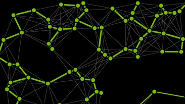

# cuGraph Notebooks

This repository contains a collection of Jupyter Notebooks that outline how to run various cuGraph analytics.   The notebooks do not address a complete data science problem.  The notebooks are simply examples of how to run the graph analytics.  Manipulation of the data before or after the graph analytic is not covered here.   Extended, more problem focused, notebooks are being created and available https://github.com/rapidsai/notebooks-extended

## Summary

| Folder          | Notebook                                                     | Description                                                  |
| --------------- | ------------------------------------------------------------ | ------------------------------------------------------------ |
| Centrality      |                                                              |                                                              |
|                 | [Katz](centrality/Katz.ipynb)                                | Compute the Katz centrality for every vertex                 |
| Community       |                                                              |                                                              |
|                 | [Louvain](community/Louvain.ipynb)                           | Identify clusters in a graph using the Louvain algorithm     |
|                 | [Spectral-Clustering](community/Spectral-Clustering.ipynb)   | Identify clusters in a  graph using Spectral Clustering with both  - Balanced Cut  - Modularity Modularity |
|                 | [Subgraph Extraction](community/Subgraph-Extraction.ipynb)   | Compute a subgraph of the existing graph including only the specified vertices |
|                 | [Triangle Counting](community/Triangle-Counting.ipynb)       | Count the number of Triangle in a graph                      |
| Components      |                                                              |                                                              |
|                 | [Connected Components](components/ConnectedComponents.ipynb) | Find weakly and strongly connected components in a graph     |
| Core            |                                                              |                                                              |
|                 | [K-Core](cores/kcore.ipynb)                                  | Extracts the K-core cluster                                  |
|                 | [Core Number](cores/core-number.ipynb)                       | Computer the Core number for each vertex in a graph          |
| Link Analysis   |                                                              |                                                              |
|                 | [Pagerank](link_analysis/Pagerank.ipynb)                     | Compute the PageRank of every vertex in a graph              |
| Link Prediction |                                                              |                                                              |
|                 | [Jacard Similarity](link_prediction/Jaccard-Similarity.ipynb) | Compute vertex similarity score using both: - Jaccard Similarity - Weighted Jaccard |
|                 | [Overlap Similarity](link_prediction/Overlap-Similarity.ipynb) | Compute vertex similarity score using the Overlap Coefficient |
| Traversal       |                                                              |                                                              |
|                 | [BFS](traversal/BFS.ipynb)                                   | Compute the Breadth First Search path from a starting vertex to every other vertex in a graph |
|                 | [SSSP](traversal/SSSP.ipynb)                                 | Single Source Shortest Path  - compute the shortest path from a starting vertex to every other vertex |
| Structure       |                                                              |                                                              |
|                 | [Renumbering](structure/Renumber.ipynb)   [Renumbering 2](structure/Renumber-2.ipynb) | Renumber the vertex IDs in a graph (two sample notebooks)    |
|                 | [Symmetrize](structure/Symmetrize.ipynb)                     | Symmetrize the edges in a graph                              |

## Requirements

Running the example in these notebooks requires:

* The latest version of RAPIDS with cuGraph.
  * Download via Docker, Conda (See [__Getting Started__](https://rapids.ai/start.html))
  
* cuGraph is dependent on the latest version of cuDF.  Please install all components of RAPIDS 
* Python 3.6+
* A system with an NVIDIA GPU:  Pascal architecture or better
* CUDA 9.2+
* NVIDIA driver 396.44+

#### Notebook Credits

- Original Authors: Bradley Rees
- Last Edit: 10/29/2019

RAPIDS Versions: 0.7.0    

Test Hardware

- GV100 32G, CUDA 9,2

##### Copyright

Copyright (c) 2019, NVIDIA CORPORATION.  All rights reserved.

Licensed under the Apache License, Version 2.0 (the "License");  you may not use this file except in compliance with the License.  You may obtain a copy of the License at

http://www.apache.org/licenses/LICENSE-2.0 

Unless required by applicable law or agreed to in writing, software distributed under the License is distributed on an "AS IS" BASIS, WITHOUT WARRANTIES OR CONDITIONS OF ANY KIND, either express or implied.  See the License for the specific language governing permissions and limitations under the License.

