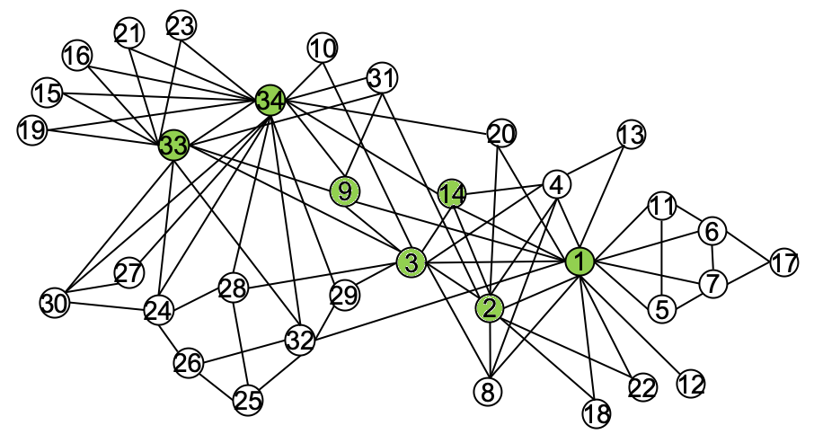

# cuGraph Centrality Notebooks

cuGraph Centrality notebooks contain a collection of Jupyter Notebooks that demonstrate algorithms to identify and quantify importance of vertices to the structure of the graph.  In the diagram above, the highlighted vertices are highly important and are likely answers to questions like:

* Which vertices have the highest degree (most direct links) ?
* Which vertices are on the most efficient paths through the graph?
* Which vertices connect the most important vertices to each other?

But which vertices are most important? The answer depends on which measure/algorithm is run.  Manipulation of the data before or after the graph analytic is not covered here.   Extended, more problem focused, notebooks are being created and available https://github.com/rapidsai/notebooks-extended

## Summary

|Algorithm          |Notebooks Containing                                                     |Description                                                  |
| --------------- | ------------------------------------------------------------ | ------------------------------------------------------------ |
|Degree Centrality| [Centrality](./Centrality.ipynb), [Degree](./Degree.ipynb)                   |Measure based on counting direct connections for each vertex|
|Betweenness Centrality| [Centrality](./Centrality.ipynb), [Betweenness](./Betweenness.ipynb)                    |Number of shortest paths through the vertex|
|Eigenvector Centrality|[Centrality](./Centrality.ipynb), [Eigenvector](./Eigenvector.ipynb)|Measure of connectivity to other important vertices (which also have high connectivity) often referred to as the influence measure of a vertex|
|Katz Centrality|[Centrality](./Centrality.ipynb), [Katz](./Katz.ipynb)                                         |Similar to Eigenvector but has tweaks to measure more weakly connected graph  |
|Pagerank|[Centrality](./Centrality.ipynb), [Pagerank](../../link_analysis/Pagerank.ipynb)                                         |Classified as both a link analysis and centrality measure by quantifying incoming links from central vertices.  |

[System Requirements](../../README.md#requirements)

| Author Credit |    Date    |  Update          | cuGraph Version |  Test Hardware |
| --------------|------------|------------------|-----------------|----------------|
| Brad Rees     | 04/19/2021 | created          | 0.19            | GV100, CUDA 11.0
| Don Acosta    | 07/05/2022 | tested / updated | 22.08 nightly   | DGX Tesla V100 CUDA 11.5

## Copyright

Copyright (c) 2019-2022, NVIDIA CORPORATION.  All rights reserved.

Licensed under the Apache License, Version 2.0 (the "License");  you may not use this file except in compliance with the License.  You may obtain a copy of the License at

http://www.apache.org/licenses/LICENSE-2.0 

Unless required by applicable law or agreed to in writing, software distributed under the License is distributed on an "AS IS" BASIS, WITHOUT WARRANTIES OR CONDITIONS OF ANY KIND, either express or implied.  See the License for the specific language governing permissions and limitations under the License.

