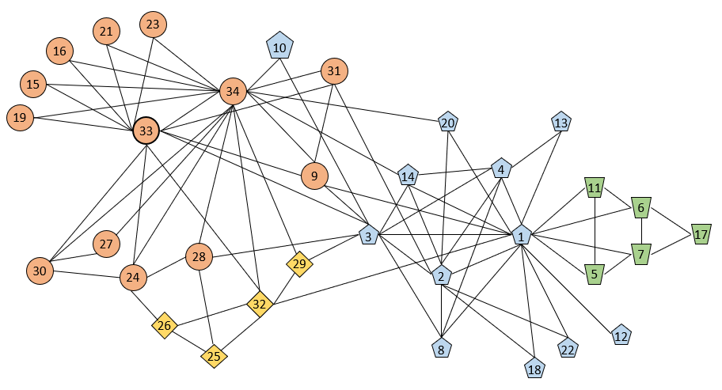

# cuGraph Community Notebooks

## cuGraph Community notebooks contain a collection of Jupyter Notebooks with algorithms that identify related groups of nodes within the graph:

* Louvain, Leiden, ECG, and Spectral Clustering all identify clusters or tightly connected vertices.
* K-Truss is a more configurable algorithm that identifies vertices in nearly fully connected cliques.
* Subgraph extraction pulls the new sub-graph formed given a set of vertices and returning only the edges contained between them.
* Triangle counting gives an important metric for quantifying the overall graph connectivity by counting fully connected triples.

## Summary

| Algorithm          | Notebook                                                     | Description                                                  |
| --------------- | ----------------------------------------- | ------------------------------------------------------------ |
|        |                                                    |                                                              |
| Louvain and Leiden                                          |[Clustering](./Community-Clustering.ipynb), [ Louvain and Leiden](./Louvain.ipynb) | Identify clusters in a graph using both the Louvain and Leiden algorithms     |
| Ensemble Clustering for Graphs  | [Clustering](./Community-Clustering.ipynb), [ECG](./ECG.ipynb)        | Identify clusters using Louvain and consensus clustering |
| K-Truss                                                     | [K-Truss](./ktruss.ipynb)                                | Extracts relaxed(based on parameter) cliques which include each vertex. |
| Spectral Clustering with Balanced Cut                       | [Clustering](./Community-Clustering.ipynb),[ Spectral-Clustering](./Spectral-Clustering.ipynb)   | Identify clusters using eigenvalues and the graph Laplacian    |
| Spectral Clustering with Modularity Maximization            | [Clustering](./Community-Clustering.ipynb),[ Spectral-Clustering](./Spectral-Clustering.ipynb)   | Identify clusters using eigenvalues and the graph Laplacian  |
| Subgraph Extraction                                         | [Subgraph Extraction](./Subgraph-Extraction.ipynb)   | Create a subgraph of the existing graph including only the specified vertices |
| Triangle Counting                                           | [Triangle Counting](./Triangle-Counting.ipynb)       | Count the number of size three cliques in a graph                      |

[System Requirements](../../README.md#requirements)

| Author Credit |    Date    |  Update          | cuGraph Version |  Test Hardware |
| --------------|------------|------------------|-----------------|----------------|
| Brad Rees     | 04/19/2021 | created          | 0.19            | GV100, CUDA 11.0
| Don Acosta    | 07/11/2022 | tested / updated | 22.08 nightly   | DGX Tesla V100 CUDA 11.5

## Copyright

Copyright (c) 2019-2022, NVIDIA CORPORATION.  All rights reserved.

Licensed under the Apache License, Version 2.0 (the "License");  you may not use this file except in compliance with the License.  You may obtain a copy of the License at

http://www.apache.org/licenses/LICENSE-2.0 

Unless required by applicable law or agreed to in writing, software distributed under the License is distributed on an "AS IS" BASIS, WITHOUT WARRANTIES OR CONDITIONS OF ANY KIND, either express or implied.  See the License for the specific language governing permissions and limitations under the License.

