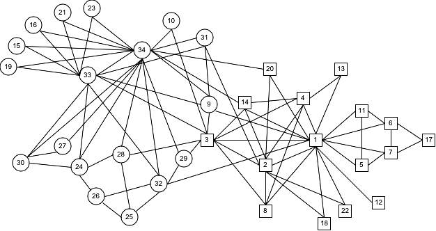

# cuGraph Core Algorithms

cuGraph Cores notebooks contain Jupyter Notebooks that demonstrate algorithms to find maximally connected subgraphs within a graph. Either identifying the maximum k-core at the vertex (core-number) or graph  level (K-Cores).

Manipulation of the data before or after the graph analytic is not covered here.   Extended, more problem focused, notebooks are being created and available https://github.com/rapidsai/notebooks-extended

## Summary

|Algorithm          |Notebooks Containing                                                     |Description                                                  |
| --------------- | ------------------------------------------------------------ | ------------------------------------------------------------ |
|Core Number   | [core-number](core-number.ipynb)   | Computes the core number for every vertex of a graph G. The core number of a vertex is a maximal subgraph that contains only that vertex and others of degree k or more. |
|K-Cores | [kcore](kcore.ipynb)               |Find the k-core of a graph which is a maximal subgraph that contains nodes of degree k or more.|

[System Requirements](https://docs.rapids.ai/install/#system-req)

## Copyright

Copyright (c) 2019-2025, NVIDIA CORPORATION.  All rights reserved.

Licensed under the Apache License, Version 2.0 (the "License");  you may not use this file except in compliance with the License.  You may obtain a copy of the License at

http://www.apache.org/licenses/LICENSE-2.0

Unless required by applicable law or agreed to in writing, software distributed under the License is distributed on an "AS IS" BASIS, WITHOUT WARRANTIES OR CONDITIONS OF ANY KIND, either express or implied.  See the License for the specific language governing permissions and limitations under the License.

