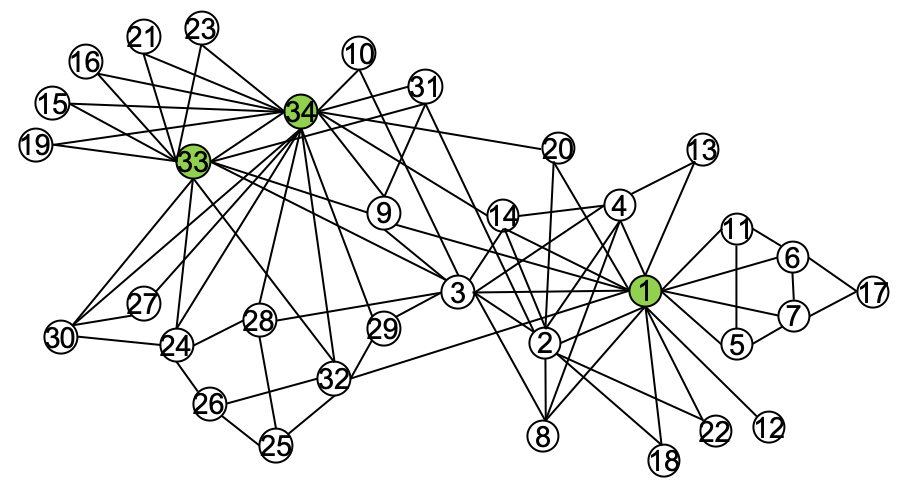

# cuGraph Link Analysis Algorithms

cuGraph Link Analysis notebooks contain Jupyter Notebooks that demonstrate algorithms to rank the importance of individual vertices within the graph. A good comparison of the two algorithms can be found [here](https://www.ijert.org/research/comparative-analysis-of-pagerank-and-hits-algorithms-IJERTV1IS8530.pdf).
In general, Pagerank is more popular because it is more efficient and takes less query time.

Manipulation of the data before or after the graph analytic is not covered here.   Extended, more problem focused, notebooks are being created and available https://github.com/rapidsai/notebooks-extended

## Summary

|Algorithm          |Notebooks Containing                                                     |Description                                                  |
| --------------- | ------------------------------------------------------------ | ------------------------------------------------------------ |
|HITS (Hyperlink-Induced Topic Search)  | [HITS](HITS.ipynb)   | Identifies hubs and authoritative sources within the graph. Originally meant to evaluate citations and reference lists in web pages. |
|PageRank | [PageRank](Pagerank.ipynb)               |Determines the importance, also called centrality, of all the vertices based on the relative importance of their neighbors.|

[System Requirements](https://docs.rapids.ai/install/#system-req)

## Copyright

Copyright (c) 2019-2025, NVIDIA CORPORATION.  All rights reserved.

Licensed under the Apache License, Version 2.0 (the "License");  you may not use this file except in compliance with the License.  You may obtain a copy of the License at

http://www.apache.org/licenses/LICENSE-2.0

Unless required by applicable law or agreed to in writing, software distributed under the License is distributed on an "AS IS" BASIS, WITHOUT WARRANTIES OR CONDITIONS OF ANY KIND, either express or implied.  See the License for the specific language governing permissions and limitations under the License.

