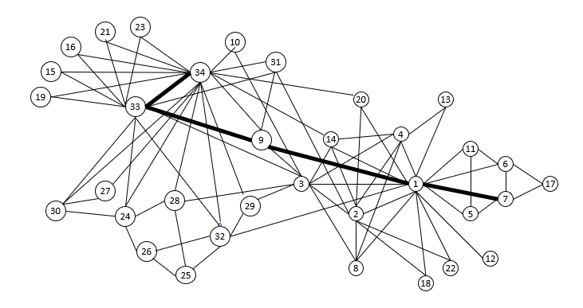

# cuGraph Traversal Algorithms

CuGraph Traversal notebooks demonstrate various algorithms for finding paths through a graph.

## Summary

|Algorithm          |Notebooks Containing                                                     |Description                                                  |
| --------------- | ------------------------------------------------------------ | ------------------------------------------------------------ |
|Breadth First Search  | [BFS](BFS.ipynb)   | Traverses all vertices reachable from a seed by exploring one hop at a time. |
|Single Source Shortest Path | [SSSP](SSSP.ipynb)   | Computes the shortest path from a single seed vertex to all the  reachable vertices in the graph. |

[System Requirements](../../README.md#requirements)

| Author Credit |    Date    |  Update          | cuGraph Version |  Test Hardware |
| --------------|------------|------------------|-----------------|----------------|
| Brad Rees     | 08/13/2019 | created          | 0.15            | GV100, CUDA 11.0
| Don Acosta    | 08/29/2022 | tested / updated | 22.10 nightly   | DGX Tesla V100 CUDA 11.5|

## Copyright

Copyright (c) 2019-2022, NVIDIA CORPORATION.  All rights reserved.

Licensed under the Apache License, Version 2.0 (the "License");  you may not use this file except in compliance with the License.  You may obtain a copy of the License at

http://www.apache.org/licenses/LICENSE-2.0 

Unless required by applicable law or agreed to in writing, software distributed under the License is distributed on an "AS IS" BASIS, WITHOUT WARRANTIES OR CONDITIONS OF ANY KIND, either express or implied.  See the License for the specific language governing permissions and limitations under the License.

