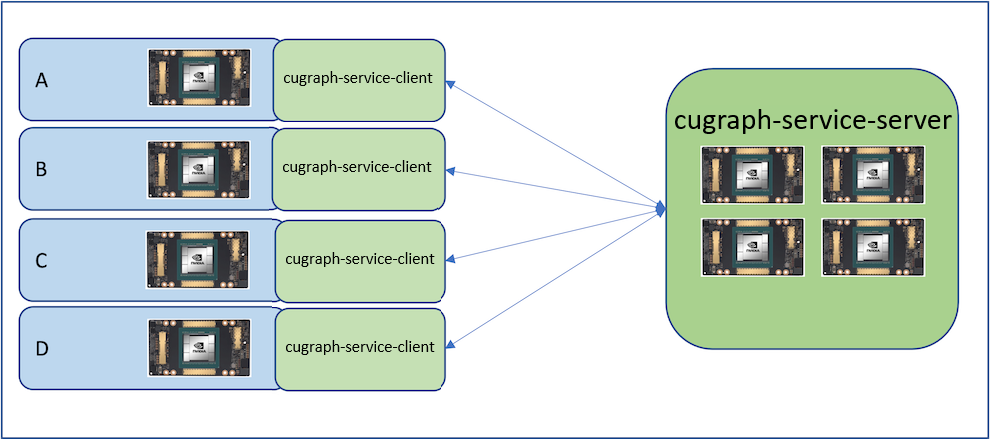

# cugraph_service

## Description
[RAPIDS](https://rapids.ai) cugraph-service provides an RPC interace to a remote [RAPIDS cuGraph](https://github.com/rapidsai/cugraph) session, allowing users to perform GPU accelerated graph analytics from a remote process. cugraph-service uses cuGraph, cuDF, and other libraries on the server to execute graph data prep and analysis on server-side GPUs. Multiple clients can connect to the server allowing different users and processes the ability to access large graph data that may not otherwise be possible using the client resources.

## <div align="center"></div>

-----

### Quick start
1. Install the cugraph-service conda packages (installing the server package also installs the client):
   ```
   conda install -c rapidsai-nightly -c rapidsai -c conda-forge -c nvidia cugraph-service-server
   ```

1. Run the server (use --help to see more options)
   - To run on a single-GPU:
   ```
   cugraph-service-server
   ```
   - To run on multiple GPUs:
   ```
   cugraph-service-server --start-local-cuda-cluster
   ```

1. Use the client in your application:
   ```
   >>> from cugraph_service_client import CugraphServiceClient
   >>> client = CugraphServiceClient()
   >>> # check connection to the server, uptime is in seconds
   >>> client.uptime()
   28

   >>> # create a graph from a CSV on the server
   >>> graph_id = client.create_graph()
   >>> client.get_graph_ids()
   [1]
   >>> client.load_csv_as_edge_data("karate.csv", dtypes=["int32", "int32", "float32"], vertex_col_names=["src", "dst"], header=0, graph_id=graph_id)

   >>> # check the graph info
   >>> client.get_graph_info(graph_id=graph_id)
   {'num_vertex_properties': 0, 'num_edge_properties': 1, 'is_multi_gpu': 0, 'num_edges': 156, 'num_vertices_from_vertex_data': 0, 'num_vertices': 34}

   >>> # run an algo
   >>> client.uniform_neighbor_sample(start_list=[0,12], fanout_vals=[2], graph_id=graph_id)
   UniformNeighborSampleResult(sources=[0, 0, 12, 12], destinations=[1, 21, 0, 3], indices=[1.0, 1.0, 1.0, 1.0])

   >>> # cleanup the graph on the server
   >>> client.delete_graph(graph_id)
   >>> client.get_graph_ids()
   []
   ```

### Debugging
#### UCX-Py related variables:
`UCX_TLS` - set the transports to use, in priority order. Example:
```
UCX_TLS=tcp,cuda_copy,cuda_ipc
```
`UCX_TCP_CM_REUSEADDR` - reuse addresses. This can be used to avoid "resource in use" errors during starting/restarting the service repeatedly.
```
UCX_TCP_CM_REUSEADDR=y
```
`UCX_LOG_LEVEL` - set the level for which UCX will output messages to the console. The example below will only output "ERROR" or higher. Set to "DEBUG" to see debug and higher messages.
```
UCX_LOG_LEVEL=ERROR
```

#### UCX performance checks:
Because cugraph-service uses UCX-Py for direct-to-client GPU data transfers when specified, it can be helpful to understand the various UCX performance chacks available to ensure cugraph-service is transfering results as efficiently as the system is capable of.
```
ucx_perftest -m cuda -t tag_bw -n 100 -s 16000 &
ucx_perftest -m cuda -t tag_bw -n 100 -s 16000 localhost
```
```
ucx_perftest -m cuda -t tag_bw -n 100 -s 1000000000 &
ucx_perftest -m cuda -t tag_bw -n 100 -s 1000000000 localhost
```
```
CUDA_VISIBLE_DEVICES=0,1 ucx_perftest -m cuda -t tag_bw -n 100 -s 16000 &
CUDA_VISIBLE_DEVICES=0,1 ucx_perftest -m cuda -t tag_bw -n 100 -s 16000 localhost
```
```
CUDA_VISIBLE_DEVICES=0,1 ucx_perftest -m cuda -t tag_bw -n 100 -s 1000000000 &
CUDA_VISIBLE_DEVICES=0,1 ucx_perftest -m cuda -t tag_bw -n 100 -s 1000000000 localhost
```
```
CUDA_VISIBLE_DEVICES=0,1 ucx_perftest -m cuda -t tag_bw -n 1000000 -s 1000000000 &
CUDA_VISIBLE_DEVICES=0,1 ucx_perftest -m cuda -t tag_bw -n 1000000 -s 1000000000 localhost
```

### Building from source
Build and install the client first, then the server. This is necessary because the server depends on shared modules provided by the client.
   ```
   $> cd cugraph_repo/python/cugraph_service/client
   $> python setup.py install
   $> cd ../server
   $> python setup.py install
   ```

------

## <div align="left"></div> Open GPU Data Science

The RAPIDS suite of open source software libraries aims to enable execution of end-to-end data science and analytics pipelines entirely on GPUs. It relies on NVIDIA® CUDA® primitives for low-level compute optimization but exposing that GPU parallelism and high-bandwidth memory speed through user-friendly Python interfaces.
