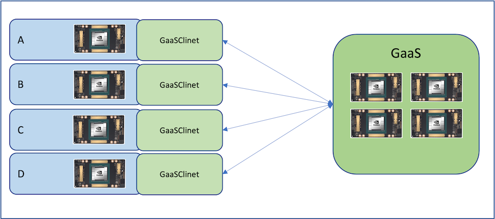

# cugraph_service

## Description
[RAPIDS](https://rapids.ai) cugraph_service provides an RPC interace to a remote [RAPIDS cuGraph](https://github.com/rapidsai/cugraph) session, allowing users to perform GPU accelerated graph analytics from a remote process. cugraph_service uses cuGraph, cuDF, and other libraries on the server to execute graph data prep and analysis on server-side GPUs. Multiple clients can connect to the server allowing different users and processes the ability to access large graph data that may not otherwise be possible using the client resources.

## <div align="center"></div>

-----

## Server
(description)
### Installing `cugraph_service_server` conda package

    TBD

### Example
Starting the server
```
$> PYTHONPATH=./python/cugraph_service python -m cugraph_service_server.server
```

## Client
(description)
### Installing the `cugraph_service_client` conda package

    TBD

### Example
Creating a client
```
>>> from cugraph_service_client import CugraphServiceClient
>>> client = CugraphServiceClient()
>>> client.load_csv_as_vertex_data(...)
```

------

## <div align="left"></div> Open GPU Data Science

The RAPIDS suite of open source software libraries aims to enable execution of end-to-end data science and analytics pipelines entirely on GPUs. It relies on NVIDIA® CUDA® primitives for low-level compute optimization but exposing that GPU parallelism and high-bandwidth memory speed through user-friendly Python interfaces.
