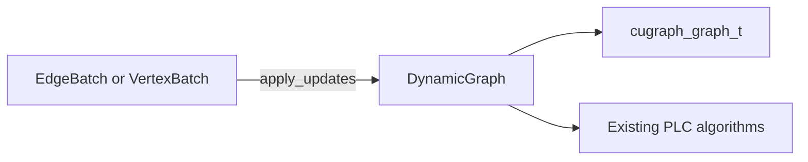

<!--
SPDX-FileCopyrightText: Copyright (c) 2026, NVIDIA CORPORATION & AFFILIATES. All rights reserved.
SPDX-License-Identifier: Apache-2.0
-->

# Dynamic Graph Python API (PLC)

Add a pylibcugraph `DynamicGraph` that is a long-lived mutable `_GPUGraph` for SG and MG. Python `apply_updates` is a thin wrapper over a new C API that shuffles (MG, same as graph create) and sort/merges the COO. Callers do not see partitioning. The first drop can be SG-only behind that C API; MG and a later dynamic `graph_t` stay the same Python/C surface.

## Goal

Give Python callers a long-lived graph they can mutate in micro-batches and then run existing cuGraph algorithms on, without introducing a service or a separate framework.

Today that object will still be backed by a static `cugraph_graph_t`. The Python type should already match the longer-term model: `cugraph_graph_t` later contains a dynamic data structure, and primitives operate on either representation. Call sites should not change when the backend does.

## Current code

PLC graphs are immutable after construction.

- [`SGGraph`](../python/pylibcugraph/pylibcugraph/graphs.pyx) / [`MGGraph`](../python/pylibcugraph/pylibcugraph/graphs.pyx) are RAII wrappers around `cugraph_graph_t*`. They expose `number_of_vertices` / `number_of_edges` and no mutators.
- PLC algorithms take Cython [`_GPUGraph`](../python/pylibcugraph/pylibcugraph/graphs.pxd) (`pagerank`, `bfs`, sampling, …). Only `SGGraph` and `MGGraph` are valid arguments.
- Construction is COO (or SG CSR) via `cugraph_graph_create_with_times_sg` / `_mg`. Optional weights, edge id/type, and `edge_start_time` / `edge_end_time` already exist on create. There is no C or Python API to add/delete/update edges on an existing `cugraph_graph_t`. **`MGGraph` does not shuffle in Python**; the MG **create C API** already redistributes edges as its first step. `apply_updates` must do the comparable thing so callers never partition by hand.
- High-level [`cugraph.Graph`](../python/cugraph/cugraph/structure/graph_classes.py) is also one-shot (`from_cudf_edgelist` raises if the graph already has values). It builds an `SGGraph` once in `_make_plc_graph` and does not thread edge times through that path.
- C++ [`cugraph/dynamic/`](../cpp/include/cugraph/dynamic/) is memory-manager scaffolding only, not a graph type.
- PageRank already accepts `initial_guess_vertices` / `initial_guess_values` as a warm start ([`pagerank.pyx`](../python/pylibcugraph/pylibcugraph/pagerank.pyx)).

To change topology today, the caller must build a new `SGGraph` (or a new `cugraph.Graph`) from a full edgelist.

## Proposed addition

A new PLC type, **`pylibcugraph.DynamicGraph`**, that **is** a graph: `cdef class DynamicGraph(_GPUGraph)`, sibling of `SGGraph` / `MGGraph`. Existing algorithm signatures do not change. Callers pass `G` the same way they pass an `SGGraph`.

```python
src = cupy.asarray([0, 1], dtype=numpy.int32)
dst = cupy.asarray([1, 2], dtype=numpy.int32)
G = pylibcugraph.DynamicGraph(handle, props, src, dst, store_transposed=True)

batch = pylibcugraph.EdgeBatch(
    src=cupy.asarray([2], dtype=numpy.int32),
    dst=cupy.asarray([0], dtype=numpy.int32),
    operation=cupy.asarray([pylibcugraph.EdgeOp.ADD], dtype=numpy.int32),
)
G.apply_updates(batch)
verts, scores = pylibcugraph.pagerank(handle, G, None, None, None, None, alpha, eps, max_iter, False)
```



What is new vs the current codebase is mutation on a graph object that algorithms already understand. What stays the same is “algorithm function + `_GPUGraph` + device-array results.” `SGGraph` vs `MGGraph` today is the same split: `DynamicGraph` is the SG object; `MGDynamicGraph` (or `DynamicGraph` constructed with an MG `ResourceHandle` / comms) is the MG sibling, both `_GPUGraph`.

High-level `cugraph.pagerank(G, as_of=...)` is a later wrapper over this PLC API, not a different mutation model.

## API

Constructor matches `SGGraph` so the same create flags apply: `resource_handle`, `graph_properties`, COO columns (`src`/`dst`, optional weight, edge id/type, start/end times, isolated `vertices`), `store_transposed`, `renumber`, `do_expensive_check`, `drop_self_loops`, `drop_multi_edges`, `symmetrize`. Empty graph is allowed.

Added surface (not on `SGGraph`):

- `apply_updates(edge_batch: EdgeBatch)` / `apply_vertex_updates(vertex_batch: VertexBatch)`
- `version` — monotonic integer, incremented after a successful batch
- `as_of(t)` / `window(t0, t1)` — return a `_GPUGraph` view for temporal queries
- inherited `number_of_vertices` / `number_of_edges`

Algorithms remain module-level functions. Do not add `G.pagerank(...)`. Incremental PageRank is the existing warm-start arguments on the same `G` after updates.

PLC does **not** take a runtime cuDF dependency. Batches are CAI columns (typically CuPy). A cuDF Series still works if the caller already has cuDF, because Series implement `__cuda_array_interface__`. High-level `cugraph` can later wrap a DataFrame by passing its columns into `EdgeBatch` / `VertexBatch`.

### `EdgeOp`

Integer codes stored on device (not Python strings in the batch arrays):

- `ADD = 0`
- `DELETE = 1`
- `UPDATE = 2`

### `EdgeBatch` / `VertexBatch`

Small Python types whose implementation is a **dict of CAI objects** (plus `None` for omitted optional columns). Construction validates CAI via the same `assert_CAI_type` path as `SGGraph`, equal lengths, and dtype consistency with existing PLC graph-create rules.

```python
EdgeBatch(
    src,              # required CAI, vertex dtype
    dst,              # required CAI, vertex dtype
    operation,        # required CAI, integer EdgeOp codes
    weight=None,
    edge_id=None,
    edge_type=None,
    timestamp=None,       # start time
    end_timestamp=None,   # end time
)

VertexBatch(
    vertex,           # required CAI, vertex dtype
    operation,        # required CAI, integer EdgeOp codes
    timestamp=None,
)
```

Access is attribute or dict-like (`batch.src`, `batch["src"]`, `batch.as_dict()` omitting `None`s). Callers do not pass a free-form dict into `apply_updates`; the batch object is the schema.

**C API mapping** (graph create today; apply-updates later):

- `src` → `src` / `src_or_offset_array` (COO)
- `dst` → `dst` / `dst_or_index_array`
- `weight` → `weight_array`
- `edge_id` → `edge_id_array`
- `edge_type` → `edge_type_array`
- `timestamp` → `edge_start_time_array`
- `end_timestamp` → `edge_end_time_array`
- `VertexBatch.vertex` → merged into `vertices_array`
- `operation` → `cugraph_graph_apply_updates` op array (not a graph-create field)

Python/Cython maps `EdgeBatch` / `VertexBatch` dicts onto those C arguments. Partitioning is **not** part of the Python API.

`DynamicGraph`’s private live store is the same dict shape as `EdgeBatch` **without** `operation` (the current edgelist plus optional `vertices` CAI). Rebuild passes those columns into `cugraph_graph_create_with_times_sg`.

### Edge identity (keys vs attributes)

The key is built from identity columns the graph actually stores. `operation` is never part of the key. **Times are always caller-managed attributes** (or part of the full-record key in the no-id multi case). PLC does not close intervals, stamp start/end times, or turn `DELETE` into an `end_timestamp` update. If the caller wants time-windowed “logical” removal, they `UPDATE` `end_timestamp` (or `timestamp`) and `as_of` / `window` filter on the stored values.

When `edge_type` is present on the graph, it is part of the key for simple graphs and for multi-graphs that have `edge_id`. That allows `(s1, d1, type=t1)` and `(s1, d1, type=t2)` in a **simple** graph.

`UPDATE` is only valid when the key is independent of payload attributes (`weight` and times).

**Simple graph** (`is_multigraph=False`).

- No `edge_type`: key is `(src, dst)`.
- With `edge_type`: key is `(src, dst, edge_type)`.
- Other columns (`weight`, `edge_id` if present, times) are attributes.
- **ADD** of an existing key is an error, even if attributes differ. Change attributes with `UPDATE`.
- **UPDATE** matches the key and overwrites attributes. Error if the key is missing. The batch must include `edge_type` when the graph has types.
- **DELETE** matches the key and **removes that edge**. Error if missing.

**Multi-graph with `edge_id`.**

- No `edge_type`: key is `(src, dst, edge_id)`.
- With `edge_type`: key is `(src, dst, edge_type, edge_id)`.
- Other columns are attributes. Parallel `(src, dst)` with different ids (or different types) is allowed.
- **ADD** of an existing key is an error.
- **UPDATE** requires `edge_id` (and `edge_type` if the graph has types), matches the key, overwrites attributes. Error if missing, or if the id exists with different endpoints/type than the batch.
- **DELETE** matches the key and removes that edge. Error if missing.

**Multi-graph with no `edge_id`.** The key is the **entire** edge record (including `edge_type` and times if stored). **`UPDATE` is not allowed**. The store is a **bag**: identical tuples may appear more than once.

- **ADD** of a tuple that already exists **appends** (multiplicity += 1).
- **DELETE** matches on the columns present in the batch. The matched rows must all be **identical** on every stored column (a homogeneous bag). Then remove **one** row (multiplicity -= 1). Empty match, or matches that differ on unspecified columns, is an error.

`DELETE` always means removal from the live edge set. An implementation may defer reclaiming storage with a mask; that is not visible in the API (filtered `as_of` views, `number_of_edges`, and later algorithms must not see deleted edges).

Vertex ADD extends the isolated-vertex list. Vertex DELETE removes the vertex and incident live edges (same edge-key rules).

### Batch order, errors, and overlapping ops

A batch is a **sequence**, not a set. Rank-major order (below) makes that sequence well-defined on MG. Key rules are applied **at that point in the sequence**.

Any error (duplicate ADD where the key must be unique, UPDATE/DELETE of a missing key, heterogeneous DELETE, bad dtypes, …) **aborts the entire batch and rolls it back**. The graph and `version` are left as they were before `apply_updates`. Partial application is not allowed; that would leave an undefined graph. Implementation can apply into a scratch COO (or keep the old `cugraph_graph_t` until the batch succeeds) so rollback is drop-scratch, not undo-log.

**ADD then DELETE of the same key:** if both ops would succeed in isolation at those points in the log, the pair is a **no-op** (add then remove, or bump multiplicity then drop one). The exception is a unique-key graph (simple, or multi with `edge_id`) when the key **already exists**: the ADD is a duplicate, the batch errors, **DELETE is never attempted**, rollback. Same for two ADDs of that key in one batch: the second ADD aborts the batch, including the first ADD.

**DELETE then ADD of the same key:** if the key is present, DELETE succeeds then ADD inserts (attributes come from the ADD). If the key is absent, DELETE errors and the batch rolls back (ADD never runs).

**MG, one `apply_updates`:** each rank holds a shard of the same batch. Rank 0’s DELETE `(s1,d1)` and rank 3’s ADD `(s1,d1)` are two rows of **one** sequence. **Rank-major order:** rank 0’s rows in local index order, then rank 1, …. After shuffle, the owning rank applies in that order. An error on any rank aborts and rolls back **all** ranks.

**Two `apply_updates` calls:** serialized by the version boundary. No overlapping calls on the same graph.

### Multi-GPU (same API, later implementation phase)

Callers never specify how edges are partitioned. `MGGraph` Python already hides that; the MG create C API shuffles. `apply_updates` must use the same (or equivalent) shuffle so SG and MG Python stay the same: pass an `EdgeBatch`, get an updated `_GPUGraph`.

C `cugraph_graph_apply_updates` (SG and MG):

- MG: shuffle batch rows onto the ranks that own those keys (same placement as graph create).
- SG and MG: sequential COO update (sort/merge/remove_if / mask) using the key rules above.
- Then the graph is ready for algorithms (`c_graph_ptr` updated or interior COO refreshed). Empty ranks remain valid.

Uniqueness is after placement. `version` and errors are collective. Renumber stays as `MGGraph` (not in PLC MG).

First drop can implement the C API for SG only (shuffle is a no-op) and turn on MG in a later phase **of this function**, not a second Python model.

## First implementation vs current create path

Add a C API, e.g. `cugraph_graph_apply_updates` / `cugraph_graph_apply_vertex_updates`, used for both SG and MG so Python/Cython stay a thin CAI → C mapping (no Python-side join logic, no caller-visible partition).

On construct: existing `cugraph_graph_create_with_times_sg` / `_mg` (MG create already shuffles).

On each successful `apply_updates`:

1. Pass `EdgeBatch` columns into the C apply-updates call (including `operation`).
2. C shuffles if MG (same idea as graph create), then applies ops **in sequence** to the live COO (thrust sort/merge/remove_if or equivalent). `DELETE` removes or internally masks; it does not write `end_timestamp`.
3. Graph internals are consistent for algorithms (rebuild static `graph_t` from the new COO, or refresh in place). Same `DynamicGraph` object / `c_graph_ptr` wrapper.
4. Increment `version` only if the whole batch succeeded (collective on MG). On error, discard scratch state and leave the previous graph.

SG first: C path with shuffle as no-op. MG enables shuffle in that same function.

This is still a full COO rewrite per batch until a dynamic structure exists. It should beat the user’s CPU path and freeze the Python and C update APIs.

Out of scope for the first drop: a true incremental PageRank solver, arbitrary property graphs, high-level `cugraph.Graph` mutation. MG is in-design; wiring shuffle in apply-updates can follow SG C API bring-up.

## Later backend (same Python and C apply-updates API)

When `cugraph_graph_t` holds a dynamic structure, `cugraph_graph_apply_updates` mutates it in place instead of sort/merging a static COO. Shuffle (MG) stays the first step. Python `apply_updates(EdgeBatch)` is unchanged.

## Tests

New [`pylibcugraph/tests/test_dynamic_graph.py`](../python/pylibcugraph/pylibcugraph/tests/test_dynamic_graph.py):

- construct `EdgeBatch` / `VertexBatch` from CuPy CAIs; reject host arrays and length mismatches
- `pagerank(handle, G, ...)` with `G` a `DynamicGraph` (SG first; MG when that phase lands)
- simple graph without types: duplicate ADD of `(src, dst)` errors; UPDATE/DELETE by `(src, dst)`
- simple graph with `edge_type`: `(s, d, t1)` and `(s, d, t2)` both ADD; duplicate `(s, d, t1)` errors; UPDATE/DELETE require type
- multi + `edge_id`: UPDATE/DELETE require the id key (and type if present); duplicate ADD of that key errors; parallel `(src, dst)` with different ids succeeds
- multi, no `edge_id`: UPDATE errors; identical ADD twice then DELETE once leaves one copy; DELETE with a heterogeneous partial match errors
- DELETE removes the edge from the live set; interval-style hiding is only via caller `UPDATE` of times plus `as_of` / `window`
- add/delete/update then pagerank vs a one-shot `SGGraph` from the equivalent live COO
- sequential batch: ADD then DELETE of a **new** key is a no-op; DELETE then ADD of an existing key leaves the ADD’s attributes; duplicate ADD on a simple graph aborts the whole batch (following DELETE in that batch does not run); graph and `version` unchanged on error
- `version` increments; a failed batch leaves graph and version unchanged
- MG (when enabled): rank-major order for the same key arriving from two ranks; callers do not partition
- `as_of` / `window` vs an explicit filtered COO; updating `G` does not change an existing view
- warm-start pagerank after an update
