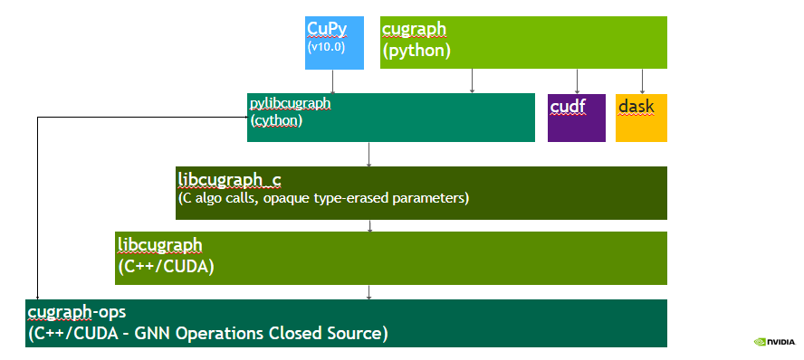

<h1 align="center";>
   
  
</h1>
<h1 align="left";>
CuGraphOps
</h1>
Cugraph-ops is a closed-source library that is composed of highly optimized and
performant primitives associated with GNNs and related graph
operations, such as training, sampling and inference. 

This is how cuGraphOps fits into the cuGraph ecosystem
<h1 align="center";>
   
  
</h1>
