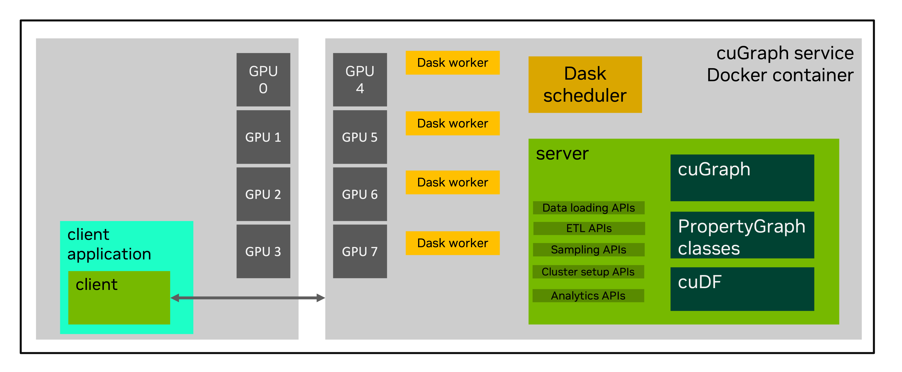
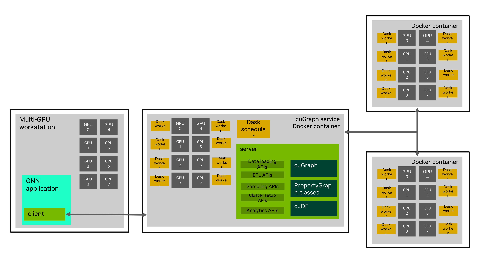

# cuGraph Service

The goal of cugraph_service is to wrap a cuGraph cluster and provide a Graph-as-a-Service feature.

Goals
* Separate large graph management and analytic code from application code
  * The application, like GNN code, should be isolated from the details of cuGraph graph management, dedicated multi-node/multi-GPU setup, feature storage and retrieval, etc. 
  * Scaling from single GPU (SG), to multi-GPU (MG), to multi-node/multi-GPU (MNMG) should not require changes to the graph integration code

* Support multiple concurrent clients/processes/threads sharing one or more graphs
  * No need for each client to have access to graph data files, perform ETL, etc.
  * Simplify concurrent programming – synchronization, batch processing details, etc. are implemented server-side
  * The GNN user should be able to easily partition and isolate hardware resources between graph analytics and training
  * The application/GNN code should be able to prefetch graph samples while training without resource contention

* Simplify MNMG deployments
  * Docker images contain all required, compatible packages
  * Clients use the same APIs for both SG and MG
  

# Picture

One option on a single DGX 

Using cugraph-service on multiple DGXs

