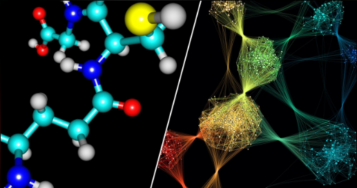
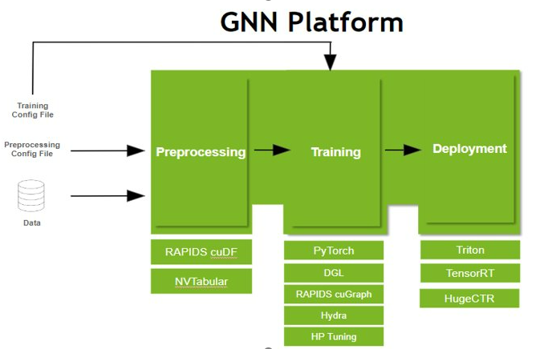
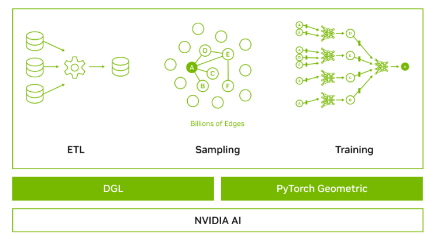

<h1 align="center";>
   
  
</h1>

<h1 align="left";>
   
GNN Support
</h1>

RAPIDS offers support to GNN (Graph Neural Networks). Several components of the RAPIDS ecosystem fit into a typical GNN framework as shown below.
An overview of GNN's and how they are used is found in this excellent [blog](https://blogs.nvidia.com/blog/2022/10/24/what-are-graph-neural-networks/).

<h1 align="center";>
  
</h1>

[RAPIDS cuDF](https://docs.rapids.ai/api/cudf/stable/user_guide/10min.html) *
[RAPIDS cuGraph](https://docs.rapids.ai/api/cugraph/stable/basics/cugraph_intro.html) *
[Property Graph](./property_graph.md) *
[NVTabular](https://developer.nvidia.com/nvidia-merlin/nvtabular) *
[NVIDIA Triton](https://developer.nvidia.com/nvidia-triton-inference-server)

RAPIDS GNN components improve other industy GNN specific projects. Due to the degree distribution of nodes, memory bottlenecks are the pain point for large scale graphs. To solve this problem, sampling operations form the backbone for Graph Neural Networks (GNN) training. However, current sampling methods provided by other libraries are not optimized enough for the whole process of GNN training. The main limit to performance is moving data between the hosts and devices. In cuGraph, we provide an end-to-end solution from data loading to training all on the GPUs.

CuGraph now supports compatibility with [Deep Graph Library](https://www.dgl.ai/) (DGL) and [PyTorch Geometric](https://pytorch-geometric.readthedocs.io/en/latest/) (PyG) by allowing conversion between a cuGraph object and a DGL or PyG object, making it possible for DGL and PyG users to access efficient data loader and graph operations (such as uniformed sampling) implementations in cuGraph, as well as keep their models unchanged in DGL or PyG. We have considerable speedup compared with the original implementation in DGL and PyG. 

