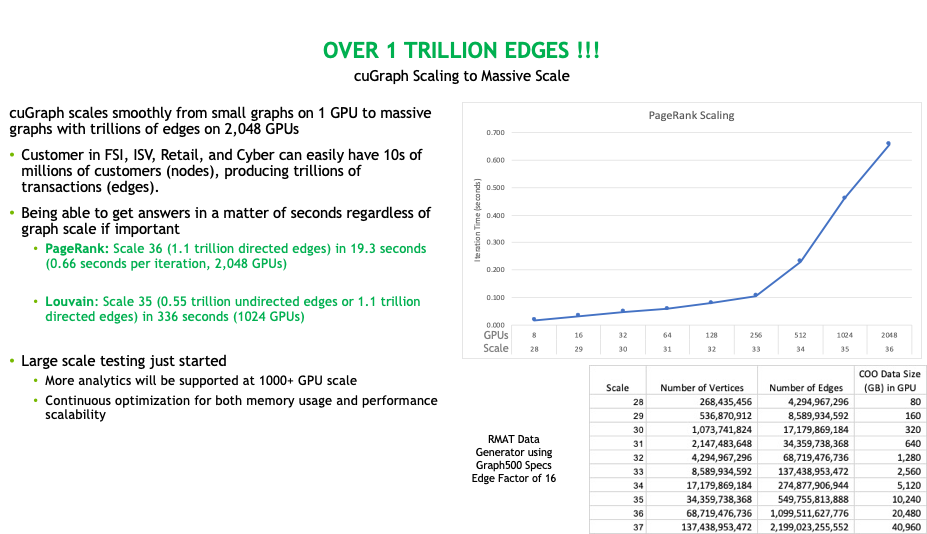
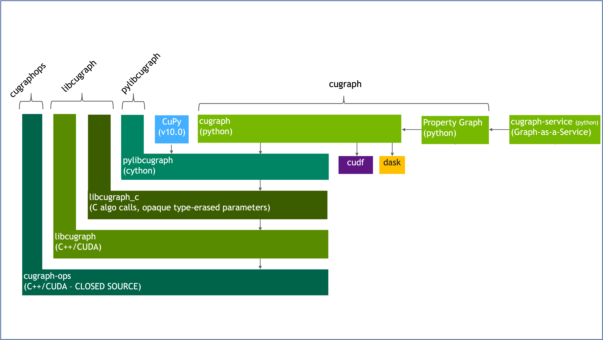

# cuGraph News

### Scaling to 1 Trillion Edges
At GTC Spring '22 we presented results of running cuGraph on the [Selene](https://top500.org/system/179842/) supercomputer using 2,048 GPUs and processing a graph with `1.1 Trillion edges`. Synthetic data created with the RMAT generator found in cuGraph. 

&nbsp; cuGraph Scaling

  

### cuGraph Software Stack
cuGraph has a new multi-layer software stack that allows users and system integrators to access cuGraph at different layers.  

&nbsp; cuGraph Software Stack

  