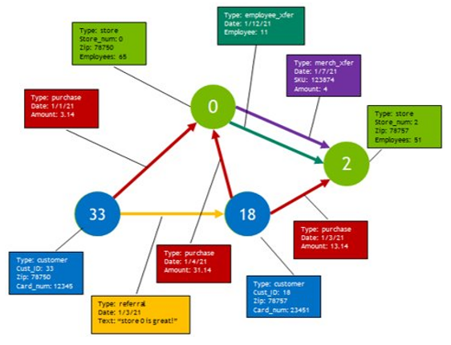

<h1 align="center";>
  <br>
  
</h1>
<h1 align="left";>
  <br>
Property Graph
</h1>

Part of [RAPIDS](https://rapids.ai) cuGraph, Property Graph allows all the great benefits of cuGraph to be applied to property-rich datasets stored in a graph structure. A Property Graph is really a data model rather than a type of graph.  Within the cuGraph ecosystem, a Property Graph is a meta-graph that can encapsulate and instantiate all the other graph types.  That view stems from property graphs being originally created for database systems.  Conceptually a Property Graph can be viewed as a property rich structure that can be projected onto any graph types.  The Dataversity, has a good definition of [Property Graph](https://www.dataversity.net/what-is-a-property-graph) which contains definitions from a collection of resources.

Property Graph enables:

* Multiple edge and node types as seen in the Property Graph API
* Subgraph extractions based on properties and/or edge and node types as seen below.
* Storage of properties either within the graph structure on gpu or using GNN-centric storage extensions on host storage.
* Adding additional properties, nodes and edges into the property graph to store derived data like analytic results.
* Client access managed by a remote server allowing shared access and remote operations using [CuGraph Service](./cugraph_service.md).

This is an example of using the cuGraph Property Graph in a two stage analysis.

```
import cudf 
import cugraph 
from cugraph.experimental import PropertyGraph

# Import a built-in dataset
from cugraph.experimental.datasets import karate

# Read edgelist data into a DataFrame, load into PropertyGraph as edge data.
# Create a graph using the imported Dataset object
graph = cugraph.Graph(directed=False)
G = karate.get_graph(create_using=graph,fetch=True)

df = G.edgelist.edgelist_df
pG = PropertyGraph() 
pG. add_edge_data(df, vertex_col_names=("src", "dst"))

# Run Louvain to get the partition number for each vertex. 
# Set resolution accordingly to identify two primary partitions. 
(partition_info, _) = cugraph.louvain(pG.extract_subgraph(create_using=graph), resolution=0.6)

# Add the partition numbers back to the Property Graph as vertex properties 
pG.add_vertex_data(partition_info, vertex_col_name="vertex")

# Use the partition properties to extract a Graph for each partition. 
G0 = pG.extract_subgraph(selection=pG.select_vertices("partition == 0"))
G1 = pG.extract_subgraph(selection=pG. select_vertices("partition == 1"))
# Run pagerank on each graph, print results. 
pageranks0 = cugraph.pagerank(G0) 
pageranks1 = cugraph.pagerank(G1) 
print(pageranks0.sort_values (by="pagerank", ascending=False).head(3))
print(pageranks1.sort_values (by="pagerank", ascending=False).head(3))
```
